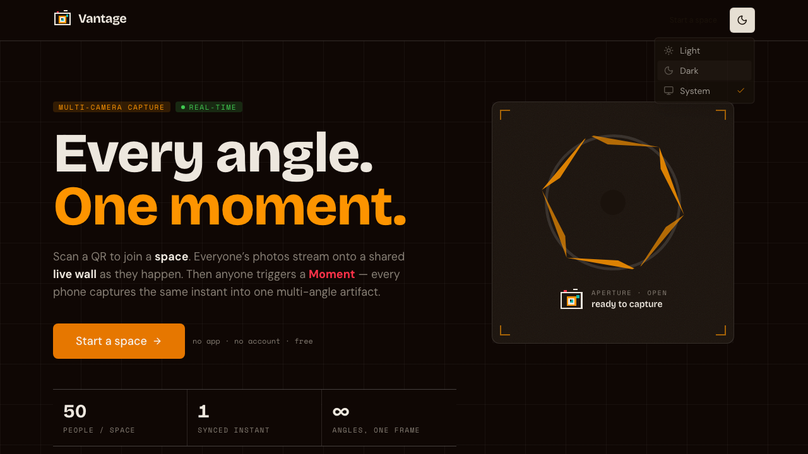
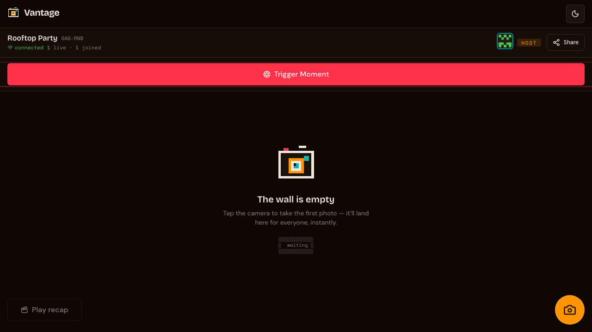

# Vantage — every angle, one moment

**Turn a room full of phones into one synchronized, multi-angle camera.**

Vantage is a real-time, multi-camera event-capture app. Scan a QR to join a *space*; everyone's photos stream onto a shared **live wall** as they happen. Then anyone triggers a **Moment** — every connected phone runs the same countdown, clocks aligned over the wire, and fires its shutter at the *exact same instant*, producing one instant photographed from every angle in the room.

It runs **entirely on the Cloudflare developer platform**, and — by design — **entirely on the free tier**. No origin server, no R2, no credit card, no container required.

🔗 **Live:** https://vantage.abhishek-aditya10.workers.dev

<p align="center">
  
  
</p>

---

## What it does

- **Join by QR / link** — no app, no account. Tap in from any phone browser, pick a name, you're on the wall.
- **Live wall** — every photo lands on a shared, real-time contact sheet, tagged with who shot it and when. Tiles animate in as they arrive.
- **Synchronized Moments** — the host triggers a 3·2·1 iris countdown that fires on *every* connected device at the same server-time instant. The frames are grouped into one multi-angle artifact.
- **Auto-recap reel** — a montage of the whole space plays back with film-strip crossfades and Ken-Burns on stills.
- **Light + dark**, mobile-first, installable PWA.

---

## Why it's interesting: a tour of the Cloudflare stack

The whole point of this project was to exercise the *entire* Cloudflare edge platform in one coherent product. Every primitive earns its place:

| Primitive | Role in Vantage |
|---|---|
| **Workers** (Hono) | API gateway: auth, Turnstile, rate-limiting, routing to Durable Objects. The Worker only runs for `/api/*`; static assets are served directly. |
| **Durable Objects** (SQLite, **free tier**) ⭐ | `SpaceRoom` — one DO per space. The real-time core: WebSocket **Hibernation** (idle sockets are free), presence, the live wall, the synchronized-Moment protocol, and **media stored directly in the DO's SQLite** (see below). |
| **Durable Objects** | `RateLimiter` — a second DO class implementing a sharded, strongly-consistent sliding-window limiter. |
| **D1** (Drizzle ORM) | A global registry of spaces, so a Cron Trigger can enumerate and expire them (you can't list Durable Objects). |
| **KV** | Edge config / hot lookups (read-optimized; deliberately kept off the write hot-path to respect the 1k-writes/day free cap). |
| **Workers AI** | Wired for optional image moderation (LlamaGuard) within the 10k-neuron/day free budget. |
| **Cron Triggers** | Nightly cleanup of inactive/expired spaces to free DO storage. |
| **Pages / Workers Assets** | Serves the installable React PWA; SPA fallback for client-side routing. |

### The "no R2, no credit card" decision

R2 would be the obvious place to store photos — but enabling R2 requires a **payment method even for the $0 free tier** (Cloudflare error `10042`). To keep Vantage *genuinely* free and card-free, media is stored as BLOBs in each space's **Durable Object SQLite** (the per-value 2 MB cap is plenty for client-compressed photos; quotas keep a space inside the 1 GB/DO free limit). Storage is feature-flagged (`STORAGE_MODE`), so flipping to R2 later is a one-line change.

### The synchronized-Moment protocol

1. Each client periodically sends a `clock_ping`; the DO replies with its server time. The client estimates a clock **offset** (`serverNow − (t0 + rtt/2)`, EMA-smoothed).
2. The host triggers a Moment → the DO picks a `captureAt` server timestamp ~3 s out and broadcasts it to everyone.
3. Each device converts `captureAt` to *local* time using its offset, runs the iris countdown, and auto-captures a frame at T₀.
4. Frames upload tagged with the `momentId`; a DO **alarm** finalizes the Moment and broadcasts the assembled multi-angle set.

---

## Security & abuse-prevention (free tier)

- **Capability tokens** — the join link *is* the credential: short-lived HS256 JWTs (`jose`), scoped to one space + role, validated and enforced for permissions *inside* the Durable Object (only the host can trigger Moments).
- **App-layer rate limiting** — sliding-window limits on space creation, joins, uploads, WebSocket messages, and Moment triggers (the `RateLimiter` DO + an in-DO per-socket throttle), since WAF rate-limiting isn't on the free plan for `*.workers.dev`.
- **Per-space quotas** — max members / media items / bytes, plus 7-day auto-expiry via Cron, to keep storage and D1/KV writes inside the free tier.
- **Cloudflare DDoS** — always-on L3/4 + L7 network scrubbing applies automatically (even on `workers.dev`).
- **Turnstile** — wired into create/join (server-side `siteverify`); ships with Cloudflare's test key and fails-open, so it's a one-step upgrade to real enforcement.
- **Hardening** — signed-secret config, security headers + CSP (`public/_headers` for the shell, middleware for the API), R2-never-exposed pattern (when R2 is used), unguessable media IDs.

> **Free upgrade:** putting Vantage behind a free Cloudflare-managed custom domain unlocks WAF custom rules, free rate-limiting rules, and Bot Fight Mode — none of which apply to a bare `*.workers.dev` host.

---

## Tech stack

**Frontend:** React 19 · Vite · TypeScript (strict) · Tailwind CSS v4 · shadcn-style primitives · `motion` · self-hosted Geist / EB Garamond / Geist Mono · hand-authored black-and-white SVG blueprint diagrams, a pixelated SVG-filter headline, and a pixel-art camera mark.
**Edge:** Cloudflare Workers · Hono · Durable Objects (SQLite + Hibernation) · D1 · KV · Workers AI · Cron · `jose` · `aws4fetch` · Drizzle ORM · Zod (shared client/worker contract).
**Tooling:** `@cloudflare/vite-plugin` (one dev server for SPA + Worker + DOs) · Wrangler · drizzle-kit.

Design direction: a **strictly-monochrome technical reference manual** — tight Geist display, editorial serif body, monospace figure labels, dot-grid plates, `FIG_00x` rails and `░` dividers. Dark-primary; the light theme is its exact white-paper inverse. Deliberately engineered to avoid the indigo-gradient / glassmorphism / Inter "AI-slop" default. (Lineage: makingsoftware.com × factory.ai.)

---

## Local development

```bash
npm install
npm run dev          # Vite + Worker + Durable Objects in one local server
```

Apply the D1 schema locally once:

```bash
npx wrangler d1 execute vantage --local --file=worker/db/migrations/0000_naive_black_crow.sql
```

Type-check & build:

```bash
npm run build        # tsc -b (client + worker + node) && vite build
```

## Deploy

```bash
npm run deploy       # build, then wrangler deploy the Vite-plugin output
# one-time: set the signing secret
printf '%s' "$(openssl rand -hex 32)" | npx wrangler secret put JWT_SECRET
```

Bindings (D1 / KV / Durable Objects / AI) are declared in `wrangler.jsonc`; resources are created with `wrangler d1 create`, `wrangler kv namespace create`, etc.

## Configuration & feature flags

Set in `wrangler.jsonc` (`vars`) or as secrets:

| Flag | Default | Meaning |
|---|---|---|
| `STORAGE_MODE` | `do` | `do` = media bytes in Durable Object SQLite (free, no R2). `r2` = R2 bucket (`MEDIA_BUCKET`). |
| `RENDER_MODE` | `client` | `client` = recap rendered on-device (free). `server` = ffmpeg Container ($5 Workers Paid). |
| `MODERATION_MODE` | `off` | `on` = screen each upload with Workers AI before storing. |
| `MODERATION_MODEL` | resnet-50 | Optional Workers AI model id used when moderation is on. |
| `TURNSTILE_SITE_KEY` | test key | Replace with a real key (+ `TURNSTILE_SECRET`) to enable Turnstile. |
| `TURNSTILE_ENFORCE` | unset | `1` = strict mode (no fail-open on infra error; cross-check hostname/action). |
| `TURNSTILE_SECRET` (secret) | unset | Real Turnstile secret. Present ⇒ Turnstile is enforced. |
| `RENDER_SECRET` (secret) | unset | Shared secret guarding the render container endpoint (server render). |
| `JWT_SECRET` (secret) | dev fallback | HMAC signing secret — **always set in production**. |

### Phase 2 — built, behind flags

All of the below is **implemented and type-checks/builds today**; it stays dormant until you flip the matching flag and (where noted) uncomment a binding in `wrangler.jsonc`. Defaults keep Vantage on the pure free tier.

- **R2 storage** (`STORAGE_MODE=r2`) — `worker/storage.ts` provides a `MediaBlobStore` abstraction with DO-SQLite and R2 backends; the `SpaceRoom` DO already routes every put/get/delete + quota through it. Enable: uncomment the `r2_buckets` block, set the flag. (R2 needs a payment method even on its free tier — Cloudflare `10042`.)
- **Server-side recap render** (`RENDER_MODE=server`) — a Cloudflare Container running `ffmpeg` (Ken-Burns + crossfades → MP4). The Worker dispatches via `worker/render.ts`; the client (`RecapReel`) auto-prefers the server MP4 and falls back to the on-device export. Full enable checklist: **`containers/recap-render/README.md`** (needs Workers Paid).
- **Workers AI moderation** (`MODERATION_MODE=on`) — `worker/moderation.ts` screens uploads in the Worker before they hit the DO; fails open on any error/budget.
- **Real Turnstile + strict enforcement** — set `TURNSTILE_SECRET` (real) to enforce; add `TURNSTILE_ENFORCE=1` for fail-closed + hostname/action checks. A free Cloudflare-managed custom domain additionally unlocks WAF rules and Bot Fight Mode.

---

## Project structure

```
vantage/
├── worker/                 # Cloudflare Worker (edge)
│   ├── index.ts            # Hono gateway + routes + Cron + DO exports
│   ├── space-room.ts       # SpaceRoom Durable Object (realtime + media + Moments)
│   ├── rate-limiter.ts     # RateLimiter Durable Object (sliding window)
│   ├── storage.ts          # MediaBlobStore abstraction — DO SQLite | R2  (Phase-2)
│   ├── render.ts           # server recap dispatcher → render container       (Phase-2)
│   ├── moderation.ts       # optional Workers AI upload screening             (Phase-2)
│   ├── auth.ts             # capability-token JWTs (jose)
│   ├── turnstile.ts        # Turnstile siteverify (+ strict enforcement)
│   ├── security.ts         # security headers / CORS
│   ├── env.ts              # AppEnv + feature-flag accessors
│   └── db/                 # Drizzle D1 schema + migrations
├── containers/             # Phase-2 container assets (out of the default build)
│   └── recap-render/       # ffmpeg recap service: Dockerfile · server.mjs · DO class
├── shared/                 # Zod contract shared by client + worker
│   ├── protocol.ts         # REST + WebSocket message types
│   └── constants.ts        # quotas, limits, timings
├── src/                    # React PWA (client)
│   ├── routes/             # Landing, Create, Join, Space, NotFound
│   ├── components/         # ui/ · brand/ · landing/ (figures) · space/
│   ├── lib/                # api · useSpaceSocket · capture · pixel · config
│   └── providers/          # theme (dark-primary)
├── public/                 # manifest, icons, _headers (CSP)
└── wrangler.jsonc          # bindings, migrations, cron (+ commented Phase-2 blocks)
```

---

Built end-to-end on Cloudflare — for the moment, not the cloud.
