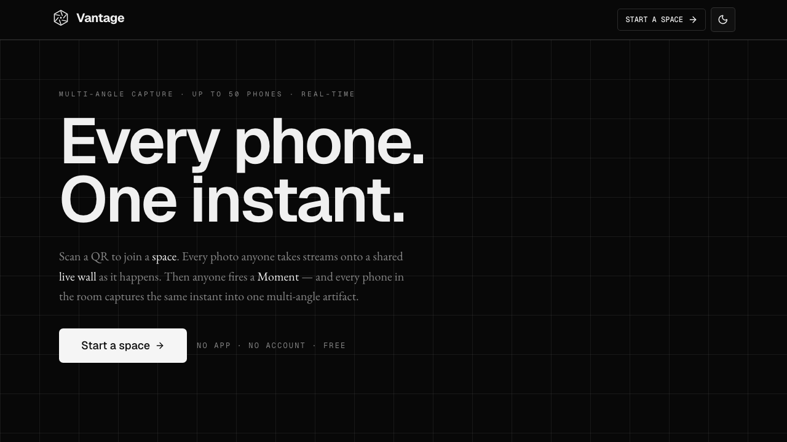
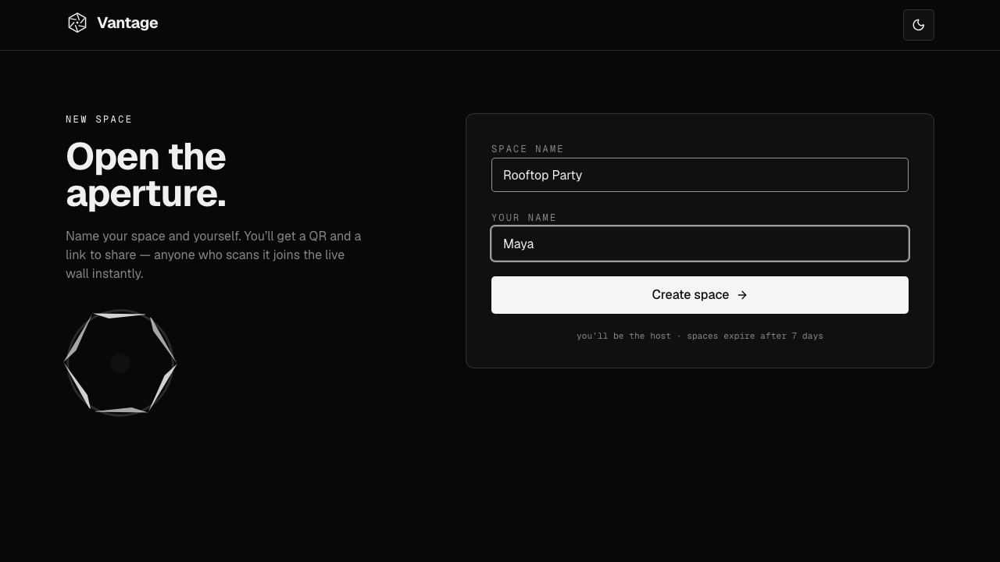
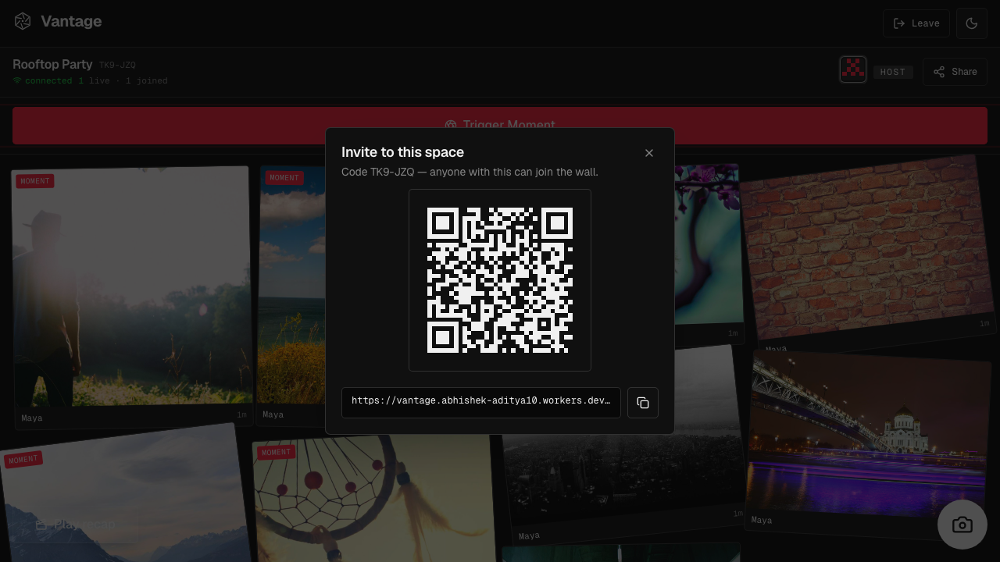
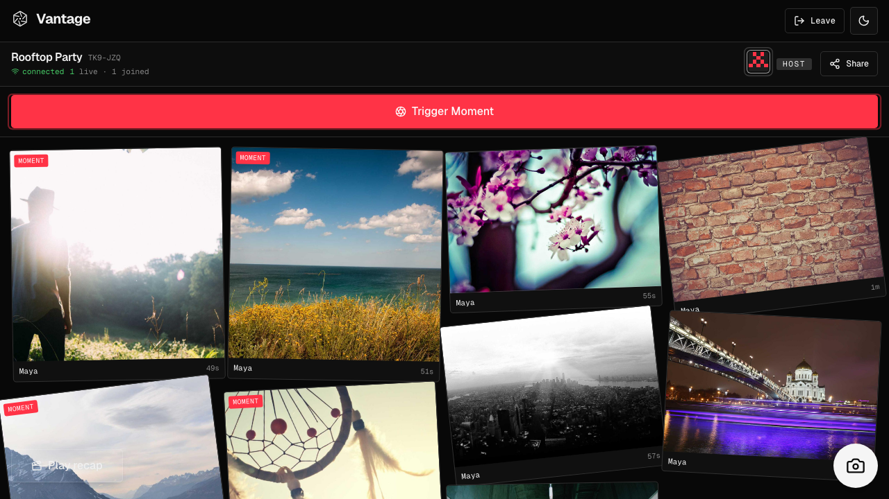
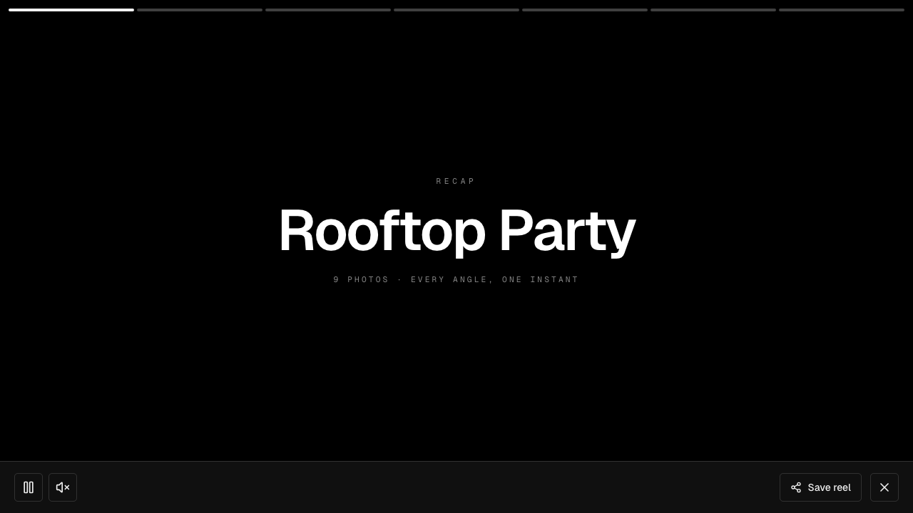
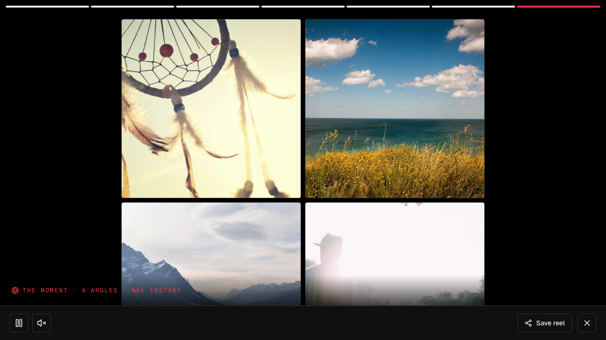
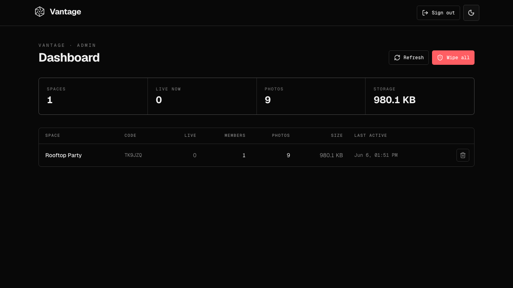

# Vantage — every angle, one instant

**Turn a room full of phones into one synchronized, multi-angle camera.**

Vantage is a real-time, multi-camera event-capture app. Scan a QR to join a *space*; everyone's photos stream onto a shared **live wall** as they happen. Then anyone fires a **Moment** — every connected phone runs the same countdown, clocks aligned over the wire, and releases its shutter at the *exact same instant* — producing one instant photographed from every angle in the room.

It runs **entirely on the Cloudflare developer platform**, and — by design — **entirely on the free tier**. No origin server, no R2, no credit card, no container required.

🔗 **Live:** https://vantage.abhishek-aditya10.workers.dev



---

## The experience, end to end

| Start a space | Invite by QR | The live wall |
|---|---|---|
|  |  |  |

| Recap — title card | Recap — a Moment, every angle | Admin dashboard |
|---|---|---|
|  |  |  |

---

## What it does

- **Join by QR / link** — no app, no account. Tap in from any phone browser, pick a name, you're on the wall.
- **Live wall** — every photo lands on a shared, real-time contact sheet, tagged with who shot it and when. Tiles animate in as they arrive.
- **Synchronized Moments** — the host triggers a 3·2·1 iris countdown that fires on *every* connected device at the same server-time instant. The frames are grouped into one **multi-angle artifact** you can step through angle-by-angle, or view as an all-angles grid.
- **Recap reel** — opens on a clean **title card** (the space name), then plays the event back: cross-faded photos + a held multi-angle "moment card" for each Moment. **Save the reel** to your phone's gallery via the native share sheet (or download on desktop).
- **Resume your spaces** — spaces you create or join are remembered in the browser, so re-entering after closing the tab is one tap on the landing — no re-sharing the link.
- **Admin dashboard** (`/admin`) — a single-admin, email-OTP-gated console listing every space with live count, photos, and storage, with delete / wipe-all.
- **Light + dark**, strictly monochrome, mobile-first, installable PWA.

---

## Why it's interesting: a tour of the Cloudflare stack

The whole point of this project was to exercise the *entire* Cloudflare edge platform in one coherent product. Every primitive earns its place:

| Primitive | Role in Vantage |
|---|---|
| **Workers** (Hono) | API gateway: auth, Turnstile, rate-limiting, admin OTP, routing to Durable Objects. The Worker only runs for `/api/*`; static assets are served directly. |
| **Durable Objects** (SQLite, **free tier**) ⭐ | `SpaceRoom` — one DO per space. The real-time core: WebSocket **Hibernation** (idle sockets are free), presence, the live wall, the synchronized-Moment protocol, and **media stored directly in the DO's SQLite** (see below). |
| **Durable Objects** | `RateLimiter` — a second DO class implementing a sharded, strongly-consistent sliding-window limiter. |
| **D1** (Drizzle ORM) | A global registry of spaces, so a Cron Trigger (and the admin dashboard) can enumerate and expire them — you can't list Durable Objects. |
| **KV** | Admin OTP storage (hashed, 10-min TTL) and edge config. |
| **Workers AI** | Optional image moderation (flag-gated, fails open) within the 10k-neuron/day free budget. |
| **Cron Triggers** | Nightly cleanup of inactive/expired spaces to free DO storage. |
| **Pages / Workers Assets** | Serves the installable React PWA; SPA fallback for client-side routing. |

### The "no R2, no credit card" decision

R2 would be the obvious place to store photos — but enabling R2 requires a **payment method even for the $0 free tier** (Cloudflare error `10042`). To keep Vantage *genuinely* free and card-free, media is stored as BLOBs in each space's **Durable Object SQLite** (the per-value 2 MB cap is plenty for client-compressed photos; quotas keep a space inside the per-DO free budget). Storage sits behind a `MediaBlobStore` abstraction and is feature-flagged (`STORAGE_MODE`), so flipping to R2 later is a one-line change.

### The synchronized-Moment protocol

1. Each client periodically sends a `clock_ping`; the DO replies with its server time. The client estimates a clock **offset** (`serverNow − (t0 + rtt/2)`, EMA-smoothed).
2. The host triggers a Moment → the DO picks a `captureAt` server timestamp ~3 s out and broadcasts it to everyone.
3. Each device converts `captureAt` to *local* time using its offset, runs the iris countdown, and auto-captures a frame at T₀.
4. Frames upload tagged with the `momentId`; a DO **alarm** finalizes the Moment and broadcasts the assembled multi-angle set.

---

## Security & abuse-prevention (free tier)

- **Capability tokens** — the join link *is* the credential: short-lived HS256 JWTs (`jose`), scoped to one space + role (host 6 h / guest 4 h), validated and enforced *inside* the Durable Object (only the host can trigger Moments).
- **Admin dashboard** — `/admin` is gated to a single allowlisted email (the `ADMIN_EMAIL` secret) via a 6-digit OTP (hashed in KV, 10-min TTL, emailed through Resend) with a master-passcode fallback; a correct code issues a 2-hour admin JWT. If the secret is unset, admin is **disabled** (fails closed).
- **App-layer rate limiting** — sliding-window limits on space creation, joins, uploads (10/min per member), WebSocket messages, Moment triggers, and admin attempts (the `RateLimiter` DO + an in-DO per-socket throttle), since WAF rate-limiting isn't on the free plan for `*.workers.dev`.
- **Per-space quotas** — max **50 members / 300 photos / 500 MB**, plus 7-day auto-expiry via Cron, to stay inside the free tier.
- **Cloudflare DDoS** — always-on L3/4 + L7 network scrubbing applies automatically (even on `workers.dev`).
- **Turnstile** — wired into create/join (server-side `siteverify`); ships with Cloudflare's test key and fails-open, so it's a one-step upgrade to real enforcement.
- **Hardening** — front-camera capture is mirrored (WYSIWYG selfies); security headers + CSP; unguessable media IDs; secrets (`JWT_SECRET`, `ADMIN_*`, etc.) never in source.

---

## Tech stack

**Frontend:** React 19 · Vite · TypeScript (strict) · Tailwind CSS v4 · shadcn-style primitives · `motion` · self-hosted **Geist / Geist Mono / EB Garamond** (Fontsource) · hand-authored monochrome SVG **blueprint diagrams**, a pixelated SVG-filter wordmark, and an aperture mark.
**Edge:** Cloudflare Workers · Hono · Durable Objects (SQLite + Hibernation) · D1 · KV · Workers AI · Cron · `jose` · Drizzle ORM · Zod (shared client/worker contract).
**Tooling:** `@cloudflare/vite-plugin` (one dev server for SPA + Worker + DOs) · Wrangler · drizzle-kit.

**Design direction:** a strictly-monochrome **"technical reference manual"** — dark-primary, with the light theme as its exact white-paper inverse. Tight Geist display, editorial EB Garamond body, Geist Mono labels, hand-drawn blueprint figures. Lineage: [makingsoftware.com](https://www.makingsoftware.com/) × [factory.ai](https://factory.ai/). Deliberately engineered to avoid the indigo-gradient / glassmorphism / Inter "AI-slop" default.

---

## Local development

```bash
npm install
npm run dev          # Vite + Worker + Durable Objects in one local server
```

Apply the D1 schema locally once:

```bash
npx wrangler d1 execute vantage --local --file=worker/db/migrations/0000_naive_black_crow.sql
```

Type-check & build:

```bash
npm run build        # tsc -b (client + worker + node) && vite build
```

## Deploy

```bash
npm run deploy       # build, then wrangler deploy the Vite-plugin output

# one-time secrets:
printf '%s' "$(openssl rand -hex 32)" | npx wrangler secret put JWT_SECRET
printf '%s' "you@example.com"         | npx wrangler secret put ADMIN_EMAIL      # who can open /admin
printf '%s' "$(openssl rand -hex 12)" | npx wrangler secret put ADMIN_PASSCODE   # bootstrap admin login
```

Bindings (D1 / KV / Durable Objects / AI) are declared in `wrangler.jsonc`; resources are created with `wrangler d1 create`, `wrangler kv namespace create`, etc.

### Enabling admin email OTP (optional)
Create a free [Resend](https://resend.com) account with your admin email, generate an API key, then:
```bash
printf '%s' "re_xxx" | npx wrangler secret put RESEND_API_KEY
```
Codes are then emailed to `ADMIN_EMAIL`; the passcode remains as a fallback.

## Configuration & feature flags

Set in `wrangler.jsonc` (`vars`) or as secrets:

| Flag | Default | Meaning |
|---|---|---|
| `STORAGE_MODE` | `do` | `do` = media in Durable Object SQLite (free, no R2). `r2` = optional upgrade once R2 is enabled. |
| `RENDER_MODE` | `client` | `client` = recap rendered + saved on-device (free). `server` = Phase-2 ffmpeg container ($5 Workers Paid). |
| `MODERATION_MODE` | `off` | `on` = screen uploads with Workers AI (fails open). |
| `TURNSTILE_SITE_KEY` | test key | Replace with a real key (+ `TURNSTILE_SECRET`) to enforce Turnstile. |
| `JWT_SECRET` (secret) | dev fallback | HMAC signing secret — **always set in production**. |
| `ADMIN_EMAIL` (secret) | unset → admin off | The one email allowed into `/admin`. |
| `ADMIN_PASSCODE` (secret) | unset | Master passcode for `/admin` (bootstrap / no-email fallback). |
| `RESEND_API_KEY` (secret) | unset | Enables emailing the admin OTP. |
| `ADMIN_SECRET` (secret) | unset → reset off | Enables the CLI `POST /api/admin/reset` maintenance endpoint. |

### Roadmap / optional upgrades (all behind flags)
- **Server-side recap render** — a Cloudflare Container running `ffmpeg` (smooth cross-fades, Ken-Burns, high-quality H.264) — needs the $5 Workers Paid plan. See `containers/recap-render/`.
- **R2 storage** — flip `STORAGE_MODE=r2` once R2 is enabled.
- **Real Turnstile + custom domain** — for enforced bot protection and free WAF rate-limiting.
- **Workers AI moderation** — set `MODERATION_MODE=on`.

---

## Project structure

```
vantage/
├── worker/                 # Cloudflare Worker (edge)
│   ├── index.ts            # Hono gateway + routes + admin + Cron + DO exports
│   ├── space-room.ts       # SpaceRoom Durable Object (realtime + media + Moments + stats)
│   ├── rate-limiter.ts     # RateLimiter Durable Object (sliding window)
│   ├── storage.ts          # MediaBlobStore abstraction (DO SQLite | R2)
│   ├── auth.ts             # capability-token JWTs (jose)
│   ├── admin.ts            # admin OTP + admin-session JWTs
│   ├── email.ts            # Resend transactional email
│   ├── render.ts           # server recap dispatch (Phase-2)
│   ├── moderation.ts       # Workers AI image moderation (flag-gated)
│   ├── turnstile.ts        # Turnstile siteverify
│   ├── security.ts         # security headers / CORS
│   └── db/                 # Drizzle D1 schema + migrations
├── containers/recap-render/# Phase-2 ffmpeg recap Container (Dockerfile + server)
├── shared/                 # Zod contract shared by client + worker
│   ├── protocol.ts         # REST + WebSocket message types
│   └── constants.ts        # quotas, limits, timings
├── src/                    # React PWA (client)
│   ├── routes/             # Landing, Create, Join, Space, Admin, NotFound
│   ├── components/         # ui/ · brand/ · landing/ (blueprint figures) · space/
│   ├── lib/                # api · adminApi · spaces (resume) · useSpaceSocket · capture
│   └── providers/          # theme
├── public/                 # manifest, icons, _headers (CSP)
└── wrangler.jsonc          # bindings, migrations, cron
```

---

Built end-to-end on Cloudflare — for the moment, not the cloud.
